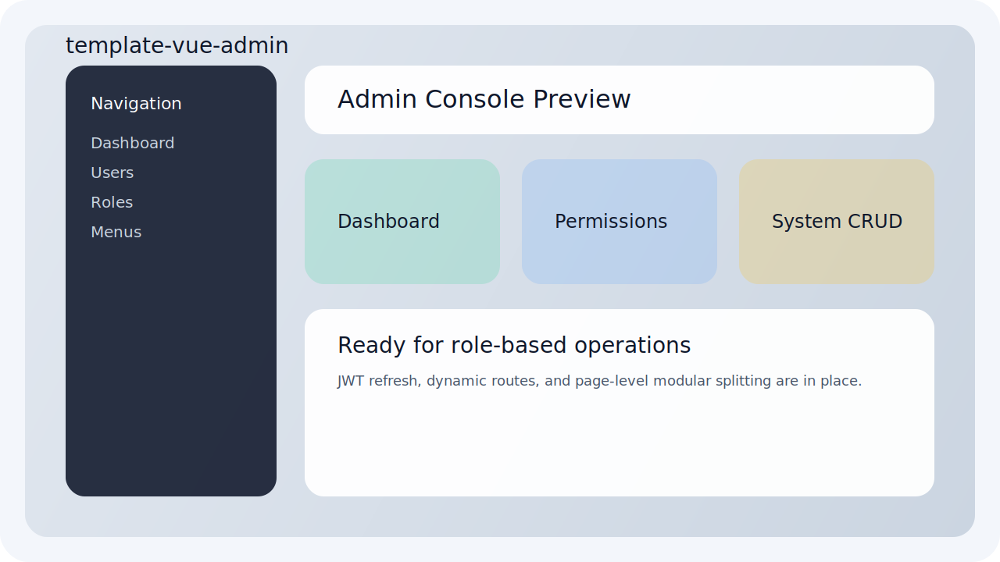
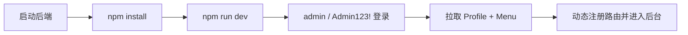
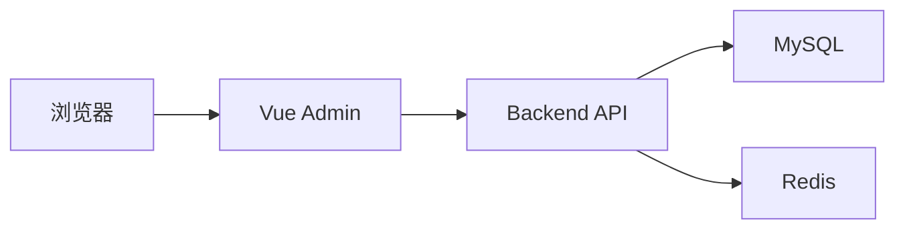
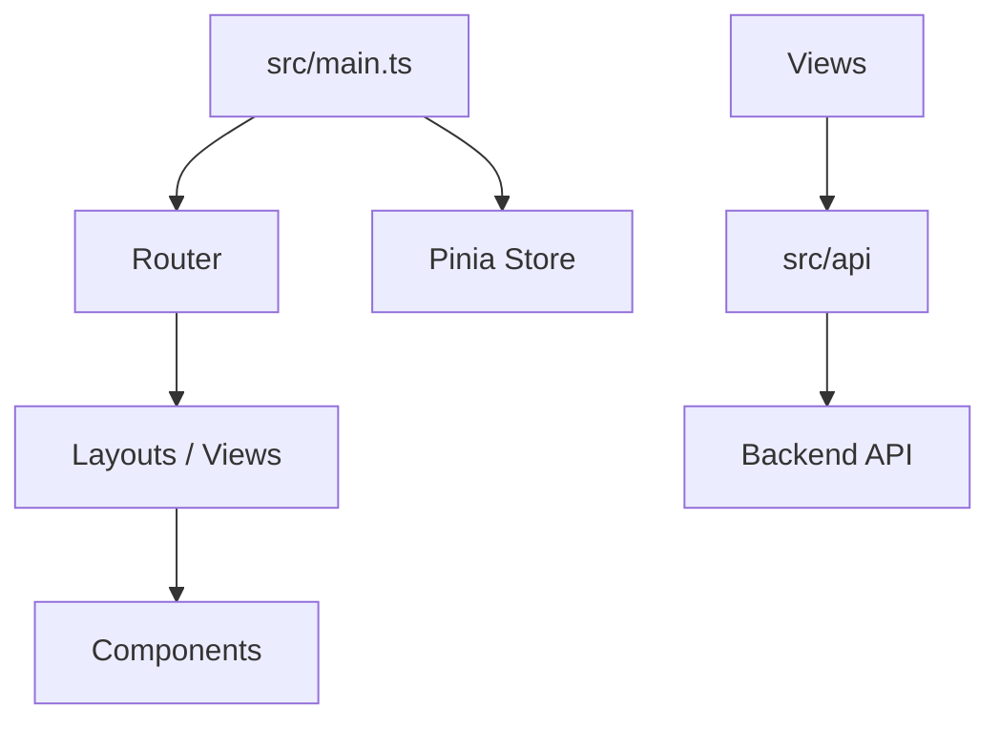
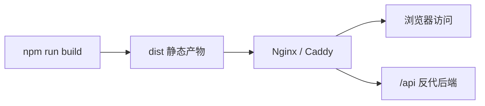

# template-vue-admin


一套基于 Vue 3 的管理后台模板，内置登录、JWT 刷新、动态菜单、RBAC 权限控制、仪表盘、用户管理、角色管理、菜单管理，可直接作为后台管理系统基座继续扩展。

## 预览占位图



## 治理文档

- [LICENSE](./LICENSE)
- [CONTRIBUTING.md](./CONTRIBUTING.md)
- [COMMIT_CONVENTION.md](./COMMIT_CONVENTION.md)
- [CODE_OF_CONDUCT.md](./CODE_OF_CONDUCT.md)
- [SECURITY.md](./SECURITY.md)
- [SUPPORT.md](./SUPPORT.md)
- [MAINTAINERS.md](./MAINTAINERS.md)
- [RELEASE.md](./RELEASE.md)
- [CHANGELOG.md](./CHANGELOG.md)
- [COLLABORATION.md](./COLLABORATION.md)

## 1. 项目定位

- 技术定位：`Vue 3 + Vite + TypeScript + Element Plus + Pinia`
- 业务定位：配合 `template-go-backend` 使用的运营后台
- 设计目标：清晰分层、接口隔离、路由动态化、权限码可扩展

## 2. 技术栈

- Vue `3.4.38`
- Vite `5.4.21`
- TypeScript `5.9.3`
- Element Plus `2.4.4`
- Pinia `2.1.7`
- Vue Router `4.2.5`
- Axios `1.6.8`
- UnoCSS `66.6.6`

## 3. 快速开始总览图



## 4. 架构图

### 4.1 前后端交互图



### 4.2 前端内部结构图



## 5. 目录结构

- `src/api`：统一接口请求层，组件内不直接拼 URL
- `src/layouts`：后台整体布局
- `src/views`：页面视图
- `src/components`：全局与模块公共组件
- `src/store`：登录态、用户信息、权限、标签页状态
- `src/router`：静态路由与守卫
- `src/types`：通用 TS 类型
- `src/utils`：存储、权限、动态路由映射
- `src/plugins`：插件注册

## 6. 已内置页面

- 登录页
- 工作台 Dashboard
- 用户管理
- 角色管理
- 菜单管理
- 个人中心
- 404 页面

## 7. 本地开发使用方式

### 7.1 安装依赖

```powershell
npm install
```

### 7.2 启动开发环境

```powershell
npm run dev
```

默认地址：

- 本地开发：`http://localhost:5173`

### 7.3 默认登录账号

需先启动后端，并使用后端默认管理员：

- 用户名：`admin`
- 密码：`Admin123!`

### 7.4 环境变量

- 开发环境：[` .env.development `](/D:/NexAI/code/admin/.env.development)
- 生产环境：[` .env.production `](/D:/NexAI/code/admin/.env.production)

关键变量：

- `VITE_API_BASE_URL`：后端 API 地址
- `VITE_APP_TITLE`：页面标题

## 8. 常用命令

```powershell
npm run dev
npm run type-check
npm run build
npm run preview
```

## 9. 权限与路由说明

- 登录成功后，先拉取 `/auth/profile`
- 再拉取 `/system/menus`
- 后台根据菜单树动态注册业务路由
- 页面按钮与路由显示由权限码控制

权限模型约定：

- `system:user:view`
- `system:user:write`
- `system:role:view`
- `system:role:write`
- `system:menu:view`
- `system:menu:write`

## 10. 部署方式

### 10.1 部署总览图



### 10.2 静态资源部署

适合 Nginx、Caddy、对象存储静态托管。

```powershell
npm run build
```

构建产物位于：

- `dist/`

Nginx 示例思路：

- 将 `dist/` 发布到静态目录
- `/api/` 反向代理到后端服务
- 所有前端路由回退到 `index.html`

### 10.3 CI 流程

当前仓库已包含基础 GitHub Actions CI：

- 安装依赖
- 类型检查
- 生产构建

### 10.4 可选增强

如需镜像化，可额外新增：

- 多阶段 Node + Nginx Dockerfile
- 生产环境 `nginx.conf`

## 11. 验证结果

当前模板已实际通过：

- `npm run type-check`
- `npm run build`

## 12. 扩展建议

- 继续按 `src/views/<module>` 增加业务页面
- 把复杂逻辑拆到组合式函数或子组件
- 与后端新增模块时，始终先在 `src/api` 中定义请求层
